# 🏗️ Architecture Documentation

Comprehensive architecture documentation for the BookStore GraphQL MongoDB application using C4 Model diagrams.

---

## 📋 Table of Contents

- [Overview](#overview)
- [C4 Model Diagrams](#c4-model-diagrams)
  - [Level 1: System Context](#level-1-system-context)
  - [Level 2: Container Diagram](#level-2-container-diagram)
  - [Level 3: Component Diagram (API)](#level-3-component-diagram-api)
  - [Level 3: Component Diagram (Frontend)](#level-3-component-diagram-frontend)
- [Data Flow](#data-flow)
- [Deployment Architecture](#deployment-architecture)
- [Testing Architecture](#testing-architecture)
- [Technology Stack](#technology-stack)

---

## 🎯 Overview

This is a **full-stack learning project** demonstrating modern web application architecture with:

- **Frontend:** Angular 18 SPA with Apollo GraphQL Client
- **Backend:** .NET 9 GraphQL API with HotChocolate
- **Database:** MongoDB with proper indexing and patterns
- **DevOps:** Docker containerization and GitHub Actions CI/CD

**Architecture Style:** Clean Architecture with clear separation of concerns

---

## 🏛️ C4 Model Diagrams

The [C4 Model](https://c4model.com/) provides a hierarchical way to visualize software architecture at different levels of abstraction.

### Level 1: System Context

**What:** Shows how the BookStore system fits into the world around it.

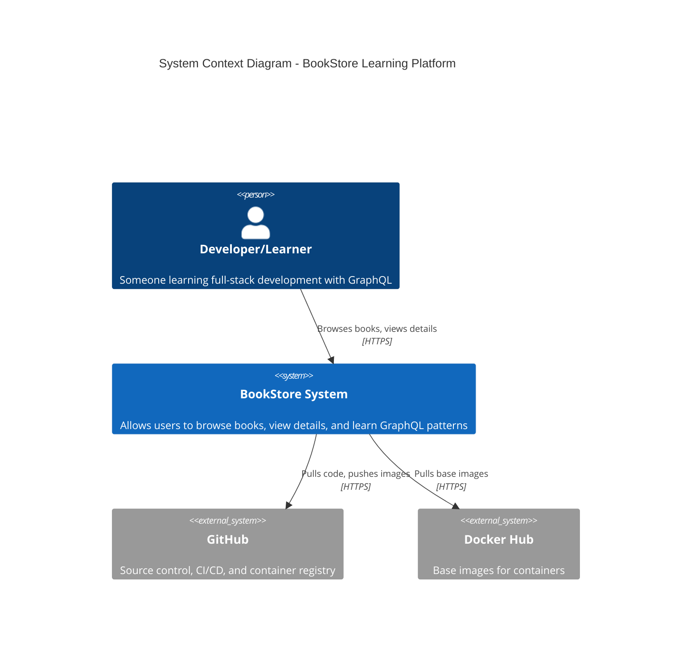

**Key Points:**
- Single user type: Developers/Learners
- Self-contained system (no external APIs)
- Integrates with GitHub for CI/CD
- Uses Docker for containerization

---

### Level 2: Container Diagram

**What:** Shows the high-level technology choices and how containers communicate.

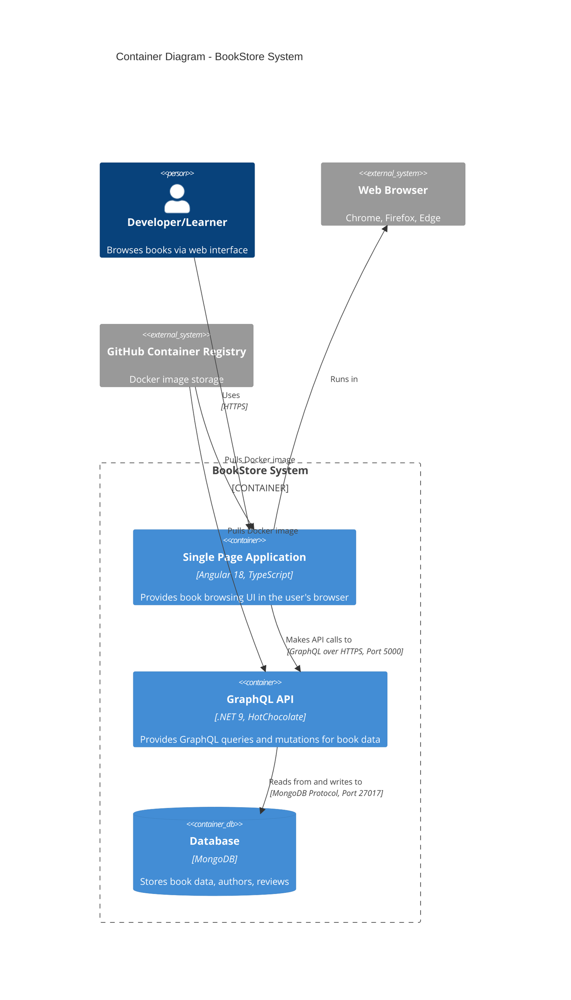

**Key Points:**
- **SPA (Angular):** Client-side application, served via Nginx in Docker
- **API (.NET 9):** Stateless GraphQL API server
- **Database (MongoDB):** NoSQL document database
- **Communication:** GraphQL over HTTP (mutations and queries)

---

### Level 3: Component Diagram (API)

**What:** Shows the internal structure of the GraphQL API container.

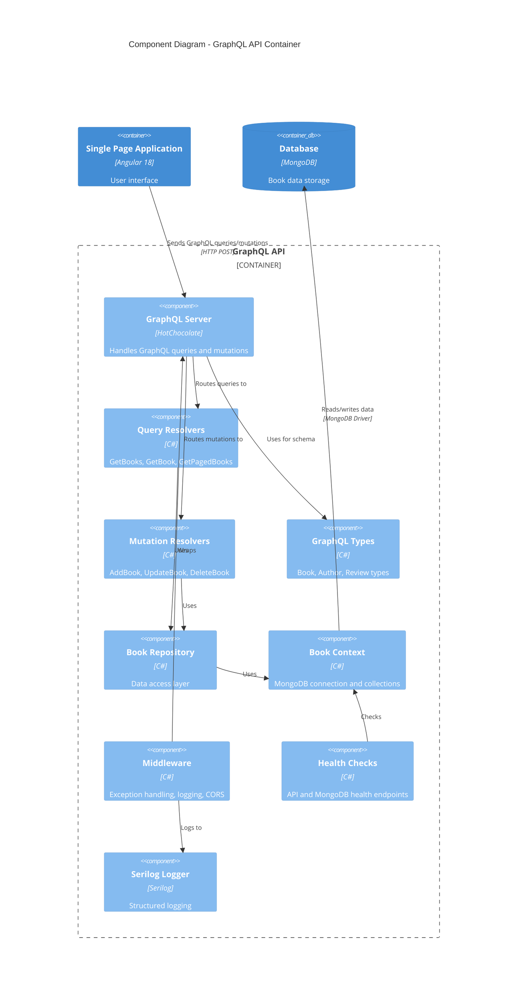

**Key Components:**

| Component | Responsibility | Technology |
|-----------|---------------|------------|
| **GraphQL Server** | Schema definition, request routing | HotChocolate 14 |
| **Query Resolvers** | Read operations (GetBooks, GetBook, etc.) | C# methods |
| **Mutation Resolvers** | Write operations (Add, Update, Delete) | C# methods |
| **Book Repository** | Data access abstraction | Repository pattern |
| **Book Context** | MongoDB client singleton | MongoDB.Driver |
| **Middleware** | Cross-cutting concerns | ASP.NET Core |
| **Health Checks** | Monitoring and diagnostics | Microsoft.Extensions |

**Patterns Used:**
- ✅ Repository Pattern (data access)
- ✅ Singleton Pattern (MongoDB client)
- ✅ Dependency Injection (all services)
- ✅ Middleware Pipeline (request processing)

---

### Level 3: Component Diagram (Frontend)

**What:** Shows the internal structure of the Angular SPA container.

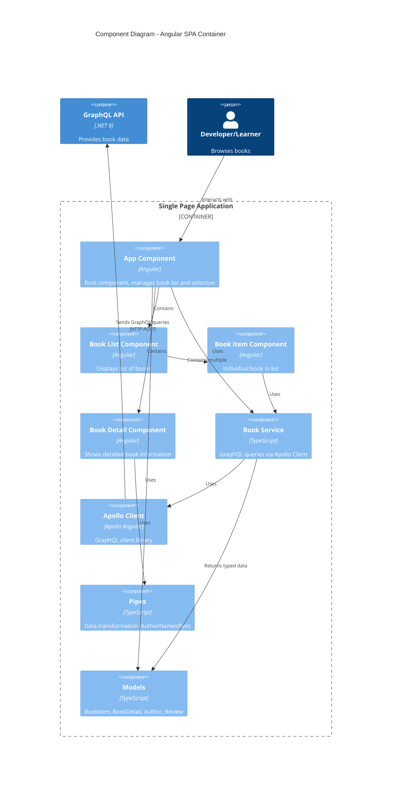

**Key Components:**

| Component | Responsibility | Lines of Code |
|-----------|---------------|---------------|
| **App Component** | Root, manages state, handles errors | ~100 |
| **Book List Component** | Displays book list, emits selections | ~30 |
| **Book Item Component** | Individual book display, click handling | ~40 |
| **Book Detail Component** | Detailed view, reviews, authors | ~50 |
| **Book Service** | GraphQL queries (secure with variables) | ~60 |
| **Apollo Client** | GraphQL HTTP client, caching | Library |
| **AuthorNamesPipe** | Transforms author array to string | ~10 |

**Patterns Used:**
- ✅ Smart/Dumb Components (Container/Presentation)
- ✅ Reactive Programming (RxJS Observables)
- ✅ Async Pipe (memory leak prevention)
- ✅ Service Injection (dependency injection)

---

## 🔄 Data Flow

### Query Flow (Read Operation)

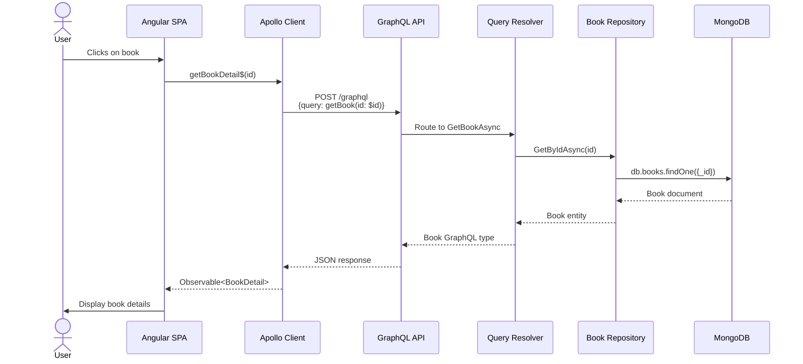

### Mutation Flow (Write Operation)

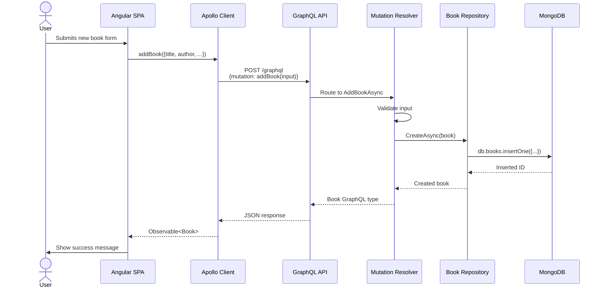

---

## 🚀 Deployment Architecture

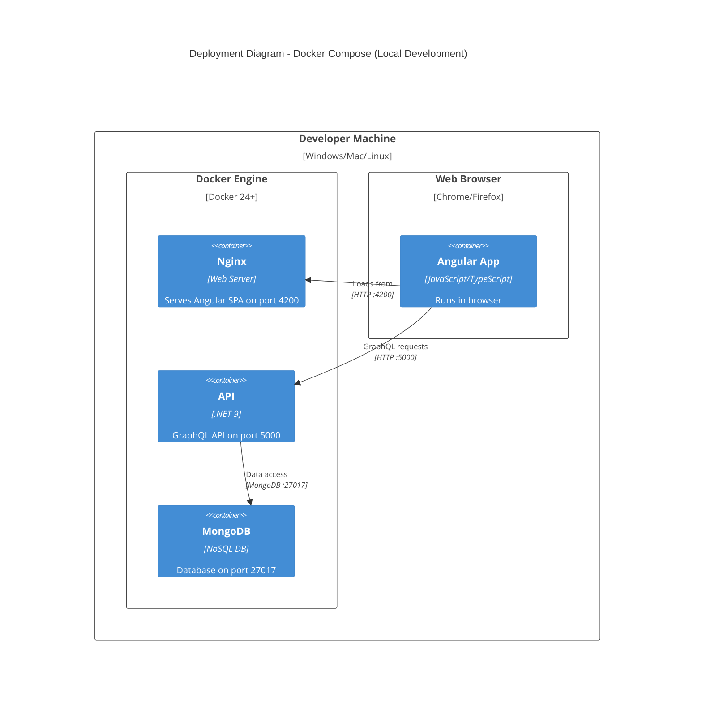

**Deployment Configurations:**

| Environment | Compose File | Purpose |
|-------------|--------------|---------|
| **Development (No Auth)** | `docker-compose.dev.yml` | MongoDB without authentication |
| **Development (With Auth)** | `docker-compose.dev-auth.yml` | MongoDB with user/password |
| **Production** | `docker-compose.yml` | Full stack with all services |

**Port Mapping:**
- **Frontend:** `http://localhost:4200` (Nginx serving Angular)
- **API:** `http://localhost:5000` (GraphQL endpoint)
- **MongoDB:** `localhost:27017` (Database connection)

---

## 🧪 Testing Architecture

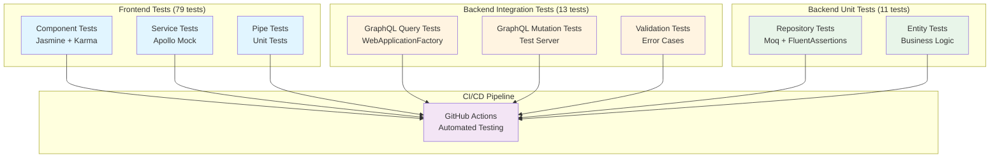

**Test Coverage:**
- 🎨 **Frontend:** 79 tests (Components, Services, Pipes)
- 🔗 **Integration:** 13 tests (Full API endpoints with MongoDB)
- 🧪 **Unit:** 11 tests (Repository and entity logic)
- 📊 **Total:** **103 tests** running in CI/CD

---

## 🛠️ Technology Stack

### Frontend Stack

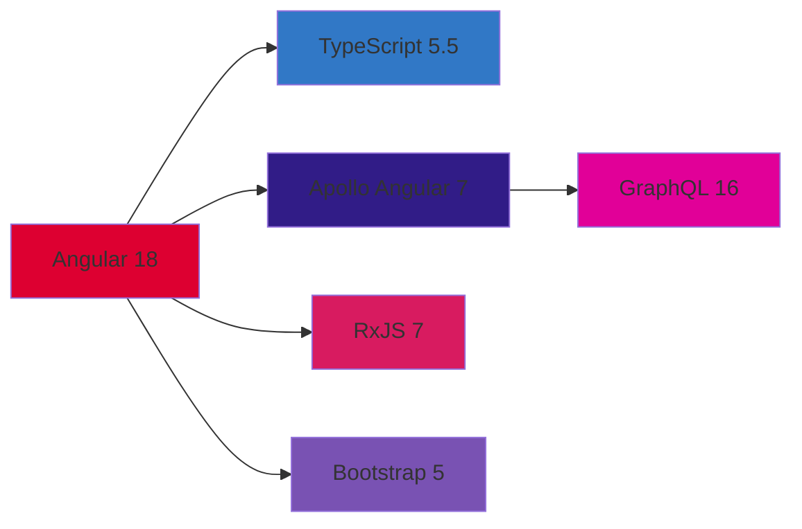

**Key Libraries:**
- **Angular 18** - Modern web framework
- **Apollo Angular 7** - GraphQL client
- **RxJS 7** - Reactive programming
- **Bootstrap 5** - UI framework
- **TypeScript 5.5** - Type safety

### Backend Stack

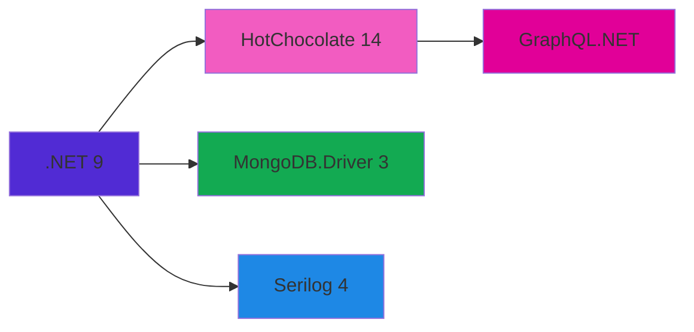

**Key Libraries:**
- **.NET 9** - Modern web platform
- **HotChocolate 14** - GraphQL server
- **MongoDB.Driver 3** - Database driver
- **Serilog 4** - Structured logging
- **xUnit** - Testing framework

### DevOps Stack

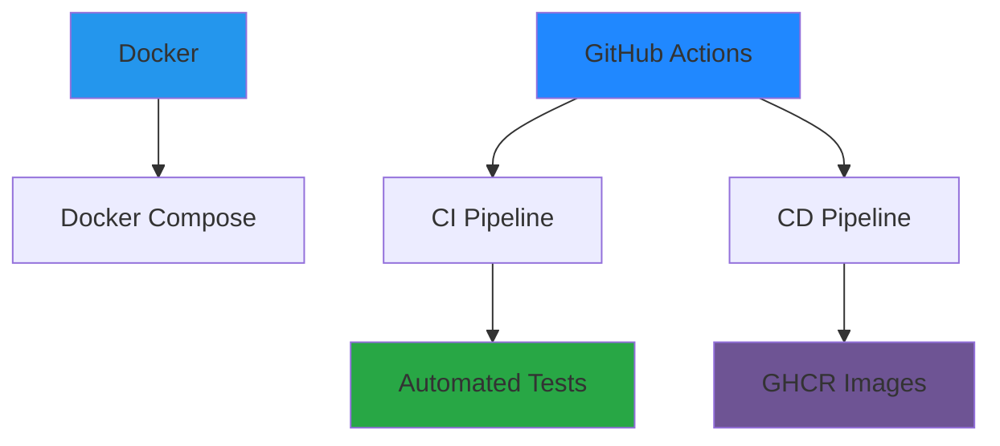

**Key Tools:**
- **Docker** - Containerization
- **Docker Compose** - Multi-container orchestration
- **GitHub Actions** - CI/CD automation
- **GHCR** - Container image registry
- **Dependabot** - Dependency updates

---

## 📊 Architecture Decisions

### Why GraphQL?

✅ **Strong typing** - Schema-first development  
✅ **Single endpoint** - Simplified API surface  
✅ **Flexible queries** - Clients request exactly what they need  
✅ **Self-documenting** - Built-in introspection and IDE support  
✅ **Learning value** - Modern API pattern  

### Why MongoDB?

✅ **Document model** - Natural fit for nested data (authors, reviews)  
✅ **Flexible schema** - Easy to evolve during learning  
✅ **No ORM needed** - Direct document access  
✅ **Good for demos** - Quick setup, no migrations  

### Why Clean Architecture?

✅ **Separation of concerns** - Easy to understand and test  
✅ **Testability** - Dependency injection throughout  
✅ **Maintainability** - Clear boundaries between layers  
✅ **Learning value** - Professional patterns  

---

## 🎓 Learning Objectives

This architecture demonstrates:

1. **Full-Stack Development**
   - Frontend SPA with modern framework
   - Backend API with GraphQL
   - Database integration

2. **Modern Patterns**
   - Repository pattern
   - Dependency injection
   - Reactive programming
   - Smart/Dumb components

3. **DevOps Practices**
   - Containerization with Docker
   - CI/CD with GitHub Actions
   - Automated testing
   - Infrastructure as Code

4. **Best Practices**
   - Clean Architecture
   - Type safety (TypeScript + C#)
   - Error handling
   - Structured logging
   - Health checks
   - Security (input validation, variable usage)

---

## 📚 Related Documentation

- **[API Documentation](API.md)** - GraphQL schema and queries
- **[Testing Guide](TESTING.md)** - 103 comprehensive tests
- **[Docker Setup](DOCKER.md)** - Containerization guide
- **[CI/CD Pipeline](CICD.md)** - Automation setup
- **[Setup Guide](SETUP.md)** - Getting started

---

## 🤝 Contributing

Want to improve the architecture?

1. **Performance:** Add caching, pagination improvements
2. **Security:** JWT auth, role-based access
3. **Features:** Filtering, sorting, search
4. **Monitoring:** Application Insights, metrics
5. **Testing:** E2E tests with Playwright

See [CONTRIBUTING.md](CONTRIBUTING.md) for guidelines.

---

**Built for learning, designed for clarity.** 🎓✨

